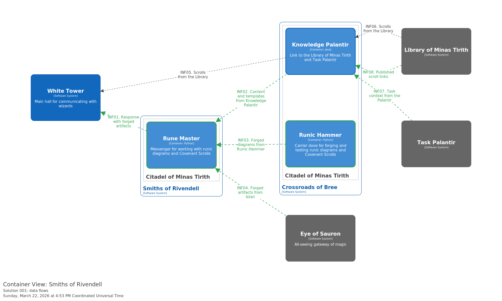
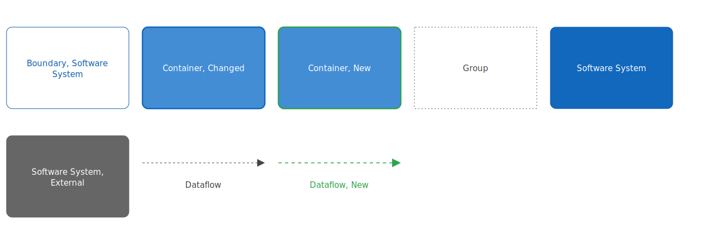
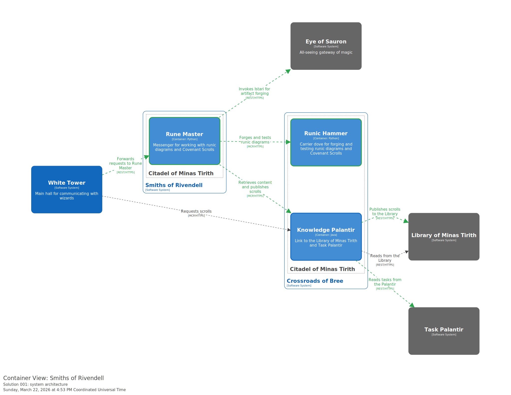
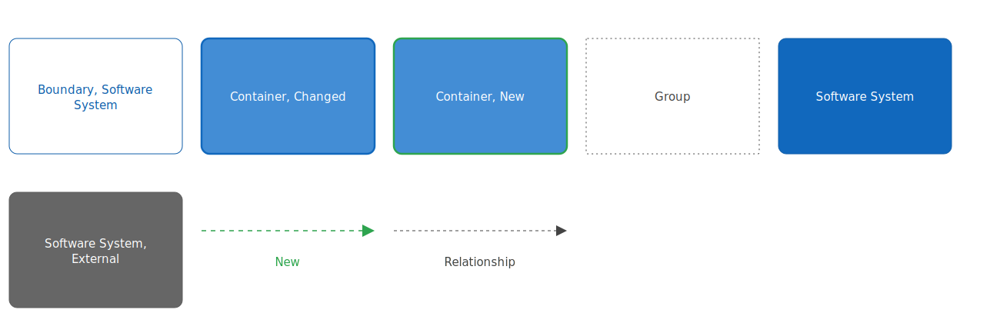

# SAD Forging Runic Diagrams and Covenant Scrolls

# 1. General Project/Task Information

## 1.1 Glossary

| Term | Description |
| --- | --- |
| Runic Diagrams | Standard for describing Middle-earth rituals as runic inscriptions |
| Covenant Scroll | Scroll containing covenants defining the Council's needs |
| Covenant Scroll Template | Approved Covenant Scroll structure |
| Task Palantir | Tool for managing Council assignments |
| Library of Minas Tirith | Repository of Council chronicles and scrolls |
| Validation Tablets | Set of artifact testing criteria |
| Intent Interpretation | Iterative clarification of a request |
| Carrier Dove | Intermediary messenger for linking Middle-earth tools |
| White Tower | Stronghold of the Council of the Wise, using Istari for knowledge interpretation |
| Mirror of the White Tower | Internal mirror for rangers to interact with the White Tower |
| Hidden Chambers of the White Tower | Secret halls of the White Tower where magic is performed |
| Istari | Great Seers gifted with foresight |
| Eye of Sauron | Council of the Wise gateway for Istari magic |
| Knowledge Palantir | Carrier dove for linking with the Task Palantir and Library of Minas Tirith |
| Runic Hammer | Carrier dove for forging and testing runic diagrams and Covenant Scrolls |
| Rune Master | Messenger for working with runic diagrams and Covenant Scrolls |
| Smiths of Rivendell | System hosting the Rune Master component |
| Crossroads of Bree | Central hub of Middle-earth hosting Knowledge Palantir and Runic Hammer |

## 1.2 Project/Task Description

**Goals:**
- Ease the burden of preparing and approving runic diagrams and Covenant Scrolls through magical acceleration
- Improve the quality and speed of ritual scroll preparation
- Enable magical forging, testing, and publishing of runic diagrams and Covenant Scrolls by incantation
- Enforce Council covenants and Validation Tablets through sorcery

**Commissioned by:** Council of the Wise

**Consumers:** Ritual Keepers, Chroniclers and rune interpreters, Council Charter Keepers

**Interested parties:** Stewards of Gondor, Blacksmith services

**Constraints:**
- Mandatory compliance with Council covenants and Validation Tablets
- Use of approved set of runic elements and templates
- Runic diagrams are formed in pure standard without extensions
- Access to capabilities through the Mirror of the White Tower
- Exclusion of manual editing on the White Tower Mirror side
- Service-level access only to public spaces of Library of Minas Tirith and Task Palantir
- Rune Master is deployed in Smiths of Rivendell; Runic Hammer is deployed at Crossroads of Bree

# 2. Business Architecture and Requirements

[BR Forging Runic Diagrams and Covenant Scrolls](../input/BR Forging Runic Diagrams and Covenant Scrolls.md)

# 3. Architecture Solution Description

## 3.1 Proposed Solution Description

The solution introduces two new components for automated forging of runic diagrams and Covenant Scrolls:

1. **Rune Master** — a new container within the Smiths of Rivendell system, responsible for orchestrating the entire forging process: receiving Ranger requests from the White Tower, enriching incantations with context from the Knowledge Palantir, invoking Istari via the Eye of Sauron for artifact generation, and coordinating diagram forging through the Runic Hammer.

2. **Runic Hammer** — a new carrier dove (MCP tool) within the Crossroads of Bree system, responsible for generating and testing runic diagrams from JSON received from Istari.

The existing **Knowledge Palantir** is extended to support reading from the Task Palantir (retrieving assignment context) and publishing/updating scrolls in the Library of Minas Tirith.

The forging process follows this sequence:
1. Ranger addresses the White Tower via the Mirror
2. White Tower forwards the request to the Rune Master
3. Rune Master retrieves context from Knowledge Palantir (Task Palantir assignments, Library content, Validation Tablets, Covenant Scroll templates)
4. Rune Master invokes Istari via Eye of Sauron for artifact forging
5. Rune Master invokes the Runic Hammer for diagram generation and testing
6. Rune Master publishes the Covenant Scroll to the Library via Knowledge Palantir
7. Rune Master composes the final response and returns it to the Ranger via White Tower

**List of systems and IT services used:**

| System/Service | Description | CMDB Link |
| --- | --- | --- |
| White Tower | Main hall for communicating with wizards | |
| Smiths of Rivendell | System hosting the Rune Master | |
| Rune Master | Messenger for working with runic diagrams and Covenant Scrolls | |
| Crossroads of Bree | Central hub of Middle-earth | |
| Knowledge Palantir | Link to the Library of Minas Tirith and Task Palantir | |
| Runic Hammer | Carrier dove for forging and testing runic diagrams and Covenant Scrolls | |
| Eye of Sauron | All-seeing gateway for Istari magic | |
| Istari | Wizards beyond the Sea | |
| Task Palantir | Tool for managing Council assignments | |
| Library of Minas Tirith | Repository of Council chronicles and scrolls | |

## 3.2 Information Architecture

### Data Flow Diagram

**Data flow description:**

| Code | Data Object | Source | Consumer | Type | Status | Mode | Data | Protocol | Transport | Comment |
| --- | --- | --- | --- | --- | --- | --- | --- | --- | --- | --- |
| INF01 | Response with forged artifacts | Rune Master | White Tower | Internal | New | Synchronous | Forged runic diagrams and Covenant Scrolls | REST/HTTPS | HTTP | Response to Ranger request |
| INF02 | Content and templates from Knowledge Palantir | Knowledge Palantir | Rune Master | Internal | New | Synchronous | Task context, Validation Tablets, Covenant Scroll templates, Library content | MCP/HTTPS | HTTP | Aggregated content for incantation enrichment |
| INF03 | Forged diagrams from Runic Hammer | Runic Hammer | Rune Master | Internal | New | Synchronous | Runic diagrams in standard format | MCP/HTTPS | HTTP | Generated from JSON via Runic Hammer |
| INF04 | Forged artifacts from Istari | Eye of Sauron | Rune Master | Internal | New | Synchronous | Diagram JSON, Covenant Scroll content | REST/HTTPS | HTTP | Via Eye of Sauron gateway with validation and masking |
| INF05 | Scrolls from the Library | Knowledge Palantir | White Tower | Internal | Existing | Synchronous | Library scrolls | MCP/HTTPS | HTTP | Existing flow for scroll retrieval |
| INF06 | Scrolls from the Library | Library of Minas Tirith | Knowledge Palantir | External | Existing | Synchronous | Library content | REST/HTTPS | HTTP | Reading from Library |
| INF07 | Task context from the Palantir | Task Palantir | Knowledge Palantir | External | New | Synchronous | Assignment context: description, participants, links | REST/HTTPS | HTTP | New integration with Task Palantir |
| INF08 | Published scroll links | Library of Minas Tirith | Knowledge Palantir | External | New | Synchronous | Links to published/updated Covenant Scrolls | REST/HTTPS | HTTP | Publishing results from Library |

## 3.3 System Architecture

### Container Diagram

# 4. Implementation

## 4.1 Implementation Requirements

- Deploy the Rune Master container within the Smiths of Rivendell infrastructure
- Deploy the Runic Hammer carrier dove within the Crossroads of Bree infrastructure
- Extend the Knowledge Palantir to support Task Palantir integration and Library publishing
- Configure MCP tool registration for Rune Master and Runic Hammer in the White Tower
- Provision Access Runes for Task Palantir, Library of Minas Tirith, and Istari integrations
- Implement Validation Tablets storage within the Knowledge Palantir
- Implement Covenant Scroll templates storage within the Knowledge Palantir

## 4.2 System and IT Service Modifications

| System/Service | Work Description |
| --- | --- |
| Smiths of Rivendell | Deploy new Rune Master container — orchestration of runic diagram and Covenant Scroll forging |
| Crossroads of Bree | Deploy new Runic Hammer carrier dove — generation and testing of runic diagrams from JSON |
| Crossroads of Bree | Extend Knowledge Palantir — add Task Palantir reading and Library publishing capabilities |
| White Tower | Register Rune Master as an available mode/tool for Rangers |

# 5. Information Security

## 5.1 Authentication and Authorization

| Purpose | Consumer System | Account Type | Status | Role | Role Status | Credential Storage | Data Flows |
| --- | --- | --- | --- | --- | --- | --- | --- |
| Retrieve task context | Knowledge Palantir | Service | New | Read-only | New | Dwarven Vaults | INF07 |
| Publish scrolls to Library | Knowledge Palantir | Service | New | Read-Write | New | Dwarven Vaults | INF08 |
| Read scrolls from Library | Knowledge Palantir | Service | Existing | Read-only | Existing | Dwarven Vaults | INF06 |
| Invoke Istari via Eye of Sauron | Rune Master | Service | New | Execution | New | Dwarven Vaults | INF04 |
| Retrieve content via Knowledge Palantir | Rune Master | Service | New | Read-Write | New | Dwarven Vaults | INF02 |
| Forge diagrams via Runic Hammer | Rune Master | Service | New | Execution | New | Dwarven Vaults | INF03 |

## 5.2 Logging and Audit

- Log all White Tower actions to stdout in accordance with Citadel Guards covenants
- Log Rune Master operations: request receipt, context retrieval, Istari invocations, artifact generation, publishing events
- Log Runic Hammer operations: diagram generation, validation results
- All logging performed in accordance with Citadel Guards covenants

## 5.3 External Data Access

Integration with external systems is performed through the following channels:
- **Eye of Sauron** — gateway for all Istari interactions (validation, masking/unmasking of data)
- **Task Palantir** — read-only access to public projects for assignment context retrieval
- **Library of Minas Tirith** — read/write access to public spaces for content retrieval and Covenant Scroll publishing

## 5.4 System and IT Service Publishing

| System/Service | Location |
| --- | --- |
| Rune Master | Citadel of Minas Tirith |
| Runic Hammer | Citadel of Minas Tirith |
| Knowledge Palantir | Citadel of Minas Tirith |

## 5.5 Flows with Protected Information

- INF04 (Istari artifacts) passes through the Eye of Sauron gateway, which performs validation and masking/unmasking of incantations before sending to Istari and upon receiving responses
- All other flows contain internal Council data (task context, scroll content, templates) — no personal or classified data is transmitted

## 5.6 File Exchange with External Systems

- Not required. All data exchange is performed via REST/HTTPS and MCP/HTTPS APIs.

# 6. Support Information

| System/Service | Development Contact | Support Team | Criticality | Technology Stack |
| --- | --- | --- | --- | --- |
| Rune Master | | | Medium | Python |
| Runic Hammer | | | Medium | Python |
| Knowledge Palantir | | | Medium | Java |
| White Tower | | | High | |

# 7. Non-Functional Requirements

| Metric | Value |
| --- | --- |
| Service load | Up to 1,500 requests per day |
| Task Palantir load limit | No more than 30 requests/min per node |
| Library of Minas Tirith load limit | No more than 30 requests/min per node |
| Availability | 24/7 |
| Secret storage | Dwarven Vaults |
| Authorization | All flows require authentication/authorization |

# 8. Open Questions

1. What specific Validation Tablets should be stored in the Knowledge Palantir for runic diagram validation?
2. What is the approved set of runic elements that the Runic Hammer should support?
3. Should the Rune Master support concurrent forging sessions for multiple Rangers?
4. What are the retention policies for forging session history and generated artifacts?
5. What are the specific Covenant Scroll templates to be preloaded (Council, Architecture, Fellowship, Forges)?
